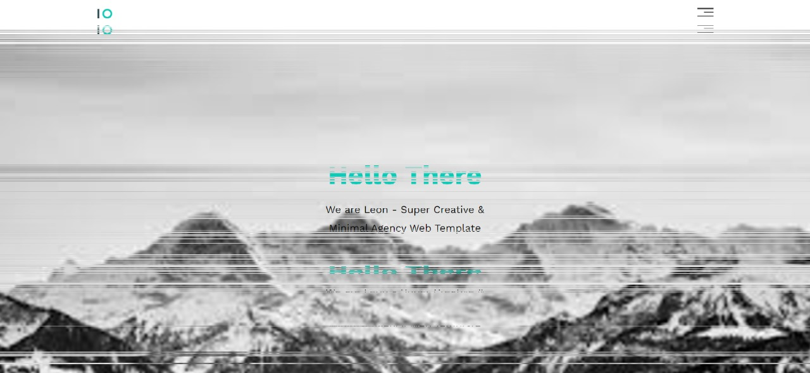
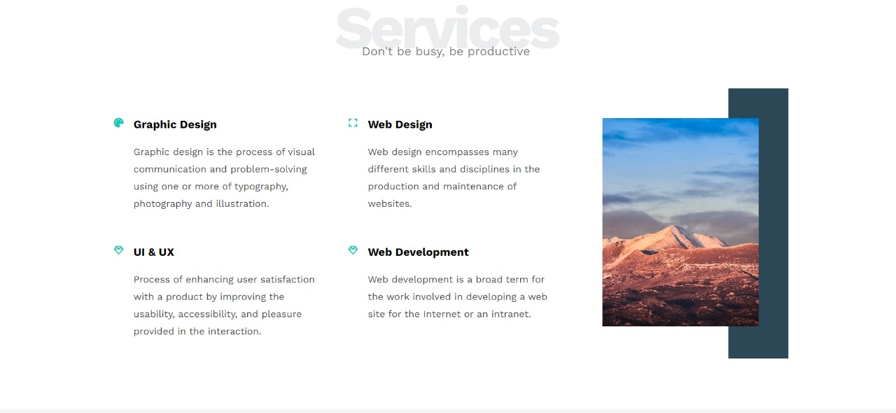

# Leon – Creative & Minimal Agency Landing Page

Leon is a modern and minimal one-page agency template designed to showcase creative services in a clean and professional style.  
The template is fully responsive and built using only HTML, CSS, and FontAwesome icons.

---

## 📌 Sections

- **Header** – Hero area introducing the agency
- **Services** – Displays main services with icons
- **Portfolio** – Showcases creative work samples
- **About** – Brief information about the agency and team
- **Contact** – Encouraging users to get in touch
- **Footer** – Contains useful links and copyright

---

## 🛠️ Technologies Used

- **HTML** – Semantic and structured layout
- **CSS** – Styling and responsive design
- **FontAwesome** – Creative icons for UI elements

---

## 📸 Screenshots

| Landing Page |
 
| Services Section |
 


## 🚀 How to Run the Project

1. Clone the repo:
   ```bash
   git clone https://github.com/SSamoel/LeonHtmlCSSTemplate.git
   ```
2.Open index.html in your favorite browser. 
3.Enjoy browsing the movies!
